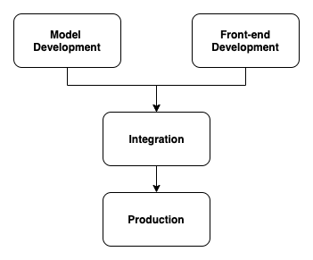

# Pelita Harapan Major Recommender System (PHMRS)

<p>&nbsp;</p>

[test](#background)

## Background

Pursuing the right major in university is very important as it will have much contribution to students future career. However, 
choosing a major can be a real issue for most final year high school students. There are many students who can't figure out
their interest or how their interest match to any major in university. Some only follow what their parents told them to be. 
This often leads to students failure in college since they are not in the right place.

If you are a final year high school students and still don't know what major fits for you, don't worry! Universitas Pelita 
Harapan (UPH) offers solution to the mentioned problem through Pelita Harapan Major Recommender System (PHMRS). You just need 
to input all your high school scores data and choose 3 majors offered at UPH that catch your attention the most, then we will 
give the most suitable major for you! 

<p>&nbsp;</p>

## Getting Started

### Prerequisites

Make sure you have the following prerequisites in order to run the application.

* [Python3](https://www.python.org/downloads/)
* [pip](https://pypi.org/project/pip/)
* [Jupyter Notebook](https://jupyter.org/)

### Running Instruction

Follow the instruction below step-by-step.

#### 1. Cloning/Downloading the Repository 

##### Option 1: Cloning

Run the following command to clone the repository:

```sh
$ git clone https://github.com/gerrychandra/educational_data_mining.git
```

##### Option 2: Downloading

* Go to https://github.com/gerrychandra/educational_data_mining
* Download the repository

#### 2. Installing the Requirements

Inside the `educational_data_mining` directory, run the following command:

```sh
$ pip install -r requirements.txt
```

#### 3. Running the Application

Run the following command to start the app:

```sh
$ python main.py 
```

You should see something like this in the terminal:

```sh
Running on http://127.0.0.1:8050/
Debugger PIN: XXX-XXX-XXX
 * Serving Flask app "main" (lazy loading)
 * Environment: production
   WARNING: This is a development server. Do not use it in a production deployment.
   Use a production WSGI server instead.
 * Debug mode: on
Running on http://127.0.0.1:8050/
Debugger PIN: XXX-XXX-XXX
```

When it appears, open your browser and go to `http://127.0.0.1:8050/` to access the app.

<p>&nbsp;</p>

## Layout and Usage

### Home Screen

The home screen will look like this:


<p>&nbsp;</p>

### Score Input

You can manually input scores by typing the number within the range of 0-100.


<p>&nbsp;</p>

### Major Input

Major options can be accessed through the dropdown list. You can either scroll or type to find the major.


<p>&nbsp;</p>

### Recommendation Result

After filling up all the necessary data, hit the button and you will see the most recommended major for you.


<p>&nbsp;</p>

## Development Flow



The diagram above shows major steps of this project development. Each block will be explained in the following subsections.

### Model Development


The whole process of model development can roughly be represented by the above diagram.
Final model used in this project is `Logistic Regression`. The raw code from data cleansing to model evaluation 
is available inside the [notebooks](notebooks) directory in this repository. If you want to understand more about the 
model development, you can check the documentation [here](docs/model_dev.md).

### Front-end Development

Front-end was developed using [Dash](dash.plot.ly). The `app` directory contains three major python scripts that makes the
application exists and alive.

* `layout.py` - contains `Root` function that calls all the layout components to render.
* `components.py` - contains the main code of UI.
* `callbacks.py` - contains input-output flow of app.

### Integration 

Model that's already fitted to the train data is then saved as pickle with `.pkl` extension. The pickled model can later
be loaded for further utilisation. [Model](model) directory contains all the three trained model with different algorithms and
one script `predictor.py`. The script contains a class called `Predictor` which will be called later to perform live 
prediction in the app using one of the three models. 

### Production

When the integration between front-end and model is successful, the app is ready to use.

<p>&nbsp;</p>

## Suggestions for Future Work

* Use different encoder to encode categorical features. Label encoder used in this project to encode `major` column might cause higher probability outcome when choosing the major with higher code order. 
* Use scaler to normalize/standardize scores features. Courses scores and final score have different range, it might be a better idea to scale the score input first before fitted to model.
* If possible, collect and gather more sample data.

<p>&nbsp;</p>

## Authors

* Gerry Chandra
* Nadya Alimin
* Budi Khusnandar

<p>&nbsp;</p>

> Made as a Frontier Technology course project at Universitas Pelita Harapan.
